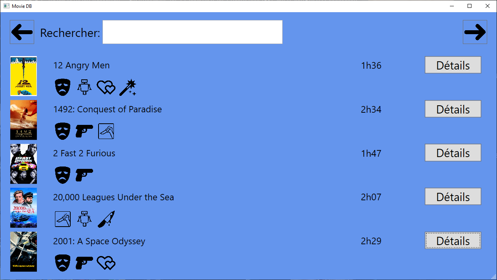
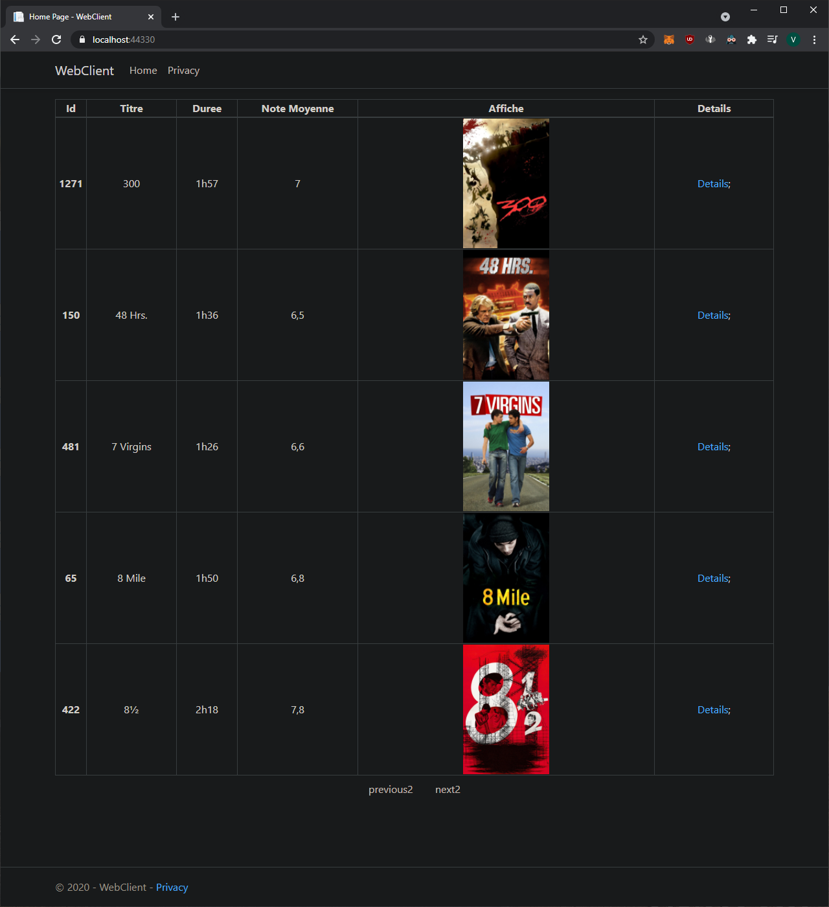

# TheMovieDB
This project was done during my studies of Computer Science at Inpres(HEPL) in Liège.

Development of a front end WPF(MVVM) app in C#, using local and remote API’s. Database in SQLite(CRUD) using Entity Framework Core and LINQ. Test driven development using Nunit.

Wpf App:

Web App:

